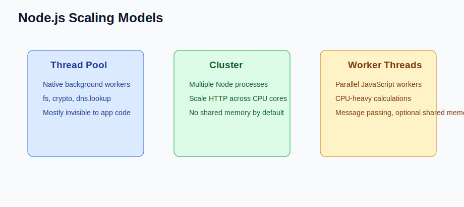

# Cluster, PM2, and Multi-process Scaling (Senior Backend Node.js Engineer Perspective)

Before going deeper into frameworks or libraries, understand this topic as part of real backend engineering: using multiple Node processes to use multiple CPU cores.

---

# 1. Fundamentals

* This topic is a production backend concern, not just a syntax detail.
* A senior Node.js engineer should understand the runtime behavior, the API contract, and the operational risks.
* The practical goal is to build services that are correct, observable, secure, and easy to change.
* Use small examples to learn the API, then connect the API to real request flows and failure modes.

---

# 2. Core Concepts

| Concept | Practical meaning |
| ------- | ----------------- |
| cluster | Core module that forks worker processes. |
| PM2 | Process manager that can run clustered Node apps. |
| Worker process | Separate process with its own event loop and memory. |
| Round robin | Common strategy for distributing connections. |
| Stateless process | Process that does not own durable user state in memory. |

---

# 3. Internal Working

* Node performance is usually about event loop health, I/O latency, payload size, database queries, and CPU hotspots.
* The libuv thread pool handles selected blocking native operations; cluster and PM2 scale across CPU cores with multiple processes.
* Worker threads parallelize CPU-heavy JavaScript inside a process.

---

# 4. Common Mistakes

* Adding cluster workers before fixing slow queries or blocking JavaScript.
* Keeping state in memory and then expecting multi-process scaling to work.
* Increasing UV_THREADPOOL_SIZE without understanding the actual bottleneck.
* Caching data without invalidation and freshness rules.

---

# 5. Best Practices

* Measure p50, p95, p99 latency, event loop lag, CPU, memory, and database timings.
* Use streaming, pagination, compression, caching, and indexes deliberately.
* Scale stateless processes horizontally.
* Use worker threads only for clear CPU-bound jobs.

---

# 6. Code Example

```bash
pm2 start src/server.js -i max
pm2 status
pm2 reload all
pm2 logs
```

---


---


# 7. Real-world Scenarios

* Building a service where cluster, pm2, and multi-process scaling affects correctness or latency.
* Debugging a production issue caused by a weak mental model of cluster, pm2, and multi-process scaling.
* Explaining cluster, pm2, and multi-process scaling in a senior backend interview with tradeoffs and examples.

---

# 8. Senior Deep Dive

## When to Use

* Measure p50, p95, p99 latency, event loop lag, CPU, memory, and database timings.
* Use streaming, pagination, compression, caching, and indexes deliberately.
* Scale stateless processes horizontally.
* Use worker threads only for clear CPU-bound jobs.

## Debug Checklist

* Reproduce with the smallest input and environment that fails.
* Inspect logs, stack traces, request data, resource usage, and dependency behavior.
* What is the measured bottleneck?
* Can this scale statelessly?
* What happens at p99 latency?

## Code Review Checklist

* What is the measured bottleneck?
* Can this scale statelessly?
* What happens at p99 latency?

---

# Revision Notes

* This topic matters because backend bugs affect users, data, security, and operations.
* Learn the runtime mental model before memorizing framework syntax.
* Prefer small examples, tests, and production-style failure checks.
* This topic is a production backend concern, not just a syntax detail.
* A senior Node.js engineer should understand the runtime behavior, the API contract, and the operational risks.
* The practical goal is to build services that are correct, observable, secure, and easy to change.

---

# Cheat Sheet

| Concept | Practical meaning |
| ------- | ----------------- |
| cluster | Core module that forks worker processes. |
| PM2 | Process manager that can run clustered Node apps. |
| Worker process | Separate process with its own event loop and memory. |
| Round robin | Common strategy for distributing connections. |
| Stateless process | Process that does not own durable user state in memory. |

---

# Interview Questions with Answers

### 1. How would you explain Cluster, PM2, and Multi-process Scaling in a real backend project?

Cluster, PM2, and Multi-process Scaling should be explained through the request or process flow it affects, the runtime behavior behind it, and the production tradeoff. A senior answer connects the API to latency, correctness, failure handling, and maintainability.

### 2. What happens internally when Cluster, PM2, and Multi-process Scaling is involved?

Node performance is usually about event loop health, I/O latency, payload size, database queries, and CPU hotspots. The libuv thread pool handles selected blocking native operations; cluster and PM2 scale across CPU cores with multiple processes. Worker threads parallelize CPU-heavy JavaScript inside a process.

### 3. What is a common production bug related to Cluster, PM2, and Multi-process Scaling?

Adding cluster workers before fixing slow queries or blocking JavaScript.

### 4. How would you debug an issue in Cluster, PM2, and Multi-process Scaling?

Reproduce the failing input, inspect logs and stack traces, isolate the boundary involved, add focused instrumentation, and write a regression test once the cause is known.

### 5. What should a senior engineer check in code review?

What is the measured bottleneck? Can this scale statelessly? What happens at p99 latency?

---

# Hands-on Exercises

## Exercise 1

Build a small example that demonstrates this topic: Cluster, PM2, and Multi-process Scaling.

### Solution

Keep it focused, handle one failure path, and write down what happens internally.

## Exercise 2

Turn this topic into a code review checklist: Cluster, PM2, and Multi-process Scaling.

### Solution

Include these checks: What is the measured bottleneck? Can this scale statelessly? What happens at p99 latency?

---

# Senior Backend Engineer Takeaway

For senior-level work, Cluster, PM2, and Multi-process Scaling is not only an API or syntax detail. You should be able to explain the mental model, choose the right pattern for a product requirement, identify common failure modes, and verify behavior with tests, logs, profiling, and production-aware review.
