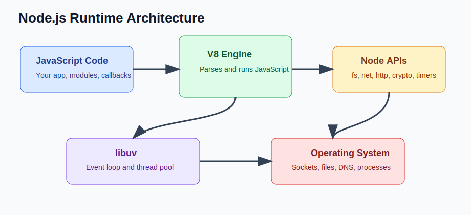

# Backend Node.js Roadmap (Senior Backend Node.js Engineer Perspective)

Before going deeper into frameworks or libraries, understand this topic as part of real backend engineering: how Node.js, HTTP, databases, security, testing, deployment, and production operations fit together.

---

# 1. Fundamentals

* This topic is a production backend concern, not just a syntax detail.
* A senior Node.js engineer should understand the runtime behavior, the API contract, and the operational risks.
* The practical goal is to build services that are correct, observable, secure, and easy to change.
* Use small examples to learn the API, then connect the API to real request flows and failure modes.

---

# 2. Core Concepts

| Concept | Practical meaning |
| ------- | ----------------- |
| Runtime | Node.js runs JavaScript outside the browser and exposes server-side APIs. |
| HTTP APIs | Express or similar frameworks receive requests, run middleware, call services, and send responses. |
| Data | Most backend features depend on durable state, indexes, migrations, validation, and consistency rules. |
| Security | Authentication, authorization, secrets, CORS, input validation, and rate limits protect the system. |
| Operations | Logs, metrics, health checks, process management, and deployment workflows keep services alive. |

---

# 3. Internal Working

* Node.js runs JavaScript on V8 and exposes server-side APIs through native bindings and libuv.
* A backend request normally flows through networking, routing, validation, business logic, persistence, and response serialization.
* Good backend code is measured by correctness, latency, reliability, security, observability, and maintainability.

---

# 4. Common Mistakes

* Learning only framework syntax and skipping runtime behavior.
* Treating local development success as production readiness.
* Keeping secrets, environment-specific paths, or one-off commands inside source code.
* Ignoring error paths, shutdown behavior, and operational visibility.

---

# 5. Best Practices

* Build small end-to-end services and inspect every boundary: HTTP, validation, logs, database, tests, and deployment.
* Prefer explicit configuration, clear module boundaries, and deterministic package installs.
* Use the Node.js documentation, framework docs, and source code when behavior matters.
* Write notes as mental models plus production failure modes, not only syntax snippets.

---

# 6. Code Example

```text
Study path:

Node runtime and event loop
Core modules: path, fs, events, streams, http
CLI tools and automation
Express APIs and middleware
MongoDB/Mongoose and data modeling
Authentication, authorization, and security
Testing, debugging, and observability
Performance, scaling, Docker, and deployment
System design and capstone projects
```

---


---


# 7. Real-world Scenarios

* Building a service where backend node.js roadmap affects correctness or latency.
* Debugging a production issue caused by a weak mental model of backend node.js roadmap.
* Explaining backend node.js roadmap in a senior backend interview with tradeoffs and examples.

---

# 8. Senior Deep Dive

## When to Use

* Build small end-to-end services and inspect every boundary: HTTP, validation, logs, database, tests, and deployment.
* Prefer explicit configuration, clear module boundaries, and deterministic package installs.
* Use the Node.js documentation, framework docs, and source code when behavior matters.
* Write notes as mental models plus production failure modes, not only syntax snippets.

## Debug Checklist

* Reproduce with the smallest input and environment that fails.
* Inspect logs, stack traces, request data, resource usage, and dependency behavior.
* What is the production failure mode?
* How do tests prove it?
* How would a teammate maintain it?

## Code Review Checklist

* What is the production failure mode?
* How do tests prove it?
* How would a teammate maintain it?

---

# Revision Notes

* This topic matters because backend bugs affect users, data, security, and operations.
* Learn the runtime mental model before memorizing framework syntax.
* Prefer small examples, tests, and production-style failure checks.
* This topic is a production backend concern, not just a syntax detail.
* A senior Node.js engineer should understand the runtime behavior, the API contract, and the operational risks.
* The practical goal is to build services that are correct, observable, secure, and easy to change.

---

# Cheat Sheet

| Concept | Practical meaning |
| ------- | ----------------- |
| Runtime | Node.js runs JavaScript outside the browser and exposes server-side APIs. |
| HTTP APIs | Express or similar frameworks receive requests, run middleware, call services, and send responses. |
| Data | Most backend features depend on durable state, indexes, migrations, validation, and consistency rules. |
| Security | Authentication, authorization, secrets, CORS, input validation, and rate limits protect the system. |
| Operations | Logs, metrics, health checks, process management, and deployment workflows keep services alive. |

---

# Interview Questions with Answers

### 1. When I ask you to design a small production API in Node.js, what layers do you expect to see and why?

A good answer separates transport, routing, validation, business logic, data access, error handling, and observability. I want to hear that Express or Fastify is only the HTTP boundary, not the whole architecture.

### 2. What should a backend Node.js developer understand beyond writing Express routes?

They should understand the event loop, async I/O, module loading, streams, process lifecycle, package management, security basics, database behavior, testing, and deployment. These are what make code survive traffic and failure.

### 3. A junior says "Node is single-threaded, so it cannot scale." How do you respond?

JavaScript execution is single-threaded per process, but Node scales well for I/O because libuv delegates many operations to the OS or a worker pool. For CPU-heavy work, use worker threads, separate services, or queues.

### 4. What signals tell you a Node.js backend is production-ready rather than just demo-ready?

It has clear error handling, health checks, structured logs, configuration validation, graceful shutdown, tests around important flows, and predictable dependency versions. It also fails closed for auth and input validation.

### 5. How do you decide what to learn first when moving from JavaScript to backend Node.js?

Follow the request path: HTTP basics, routing, async control flow, validation, persistence, errors, auth, tests, and deployment. Learn runtime internals alongside features so you can explain behavior under load.

---

# Hands-on Exercises

## Exercise 1

Build a small example that demonstrates this topic: Backend Node.js Roadmap.

### Solution

Keep it focused, handle one failure path, and write down what happens internally.

## Exercise 2

Turn this topic into a code review checklist: Backend Node.js Roadmap.

### Solution

Include these checks: What is the production failure mode? How do tests prove it? How would a teammate maintain it?

---

# Senior Backend Engineer Takeaway

For senior-level work, Backend Node.js Roadmap is not only an API or syntax detail. You should be able to explain the mental model, choose the right pattern for a product requirement, identify common failure modes, and verify behavior with tests, logs, profiling, and production-aware review.
