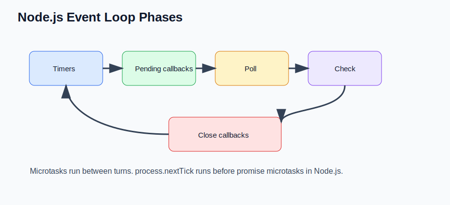

# Event Loop Phases and Microtasks (Senior Backend Node.js Engineer Perspective)

Before going deeper into frameworks or libraries, understand this topic as part of real backend engineering: understanding timers, poll, check, close callbacks, promises, and process.nextTick ordering.

---

# 1. Fundamentals

* This topic is a production backend concern, not just a syntax detail.
* A senior Node.js engineer should understand the runtime behavior, the API contract, and the operational risks.
* The practical goal is to build services that are correct, observable, secure, and easy to change.
* Use small examples to learn the API, then connect the API to real request flows and failure modes.

---

# 2. Core Concepts

| Concept | Practical meaning |
| ------- | ----------------- |
| Timers | Runs callbacks scheduled by setTimeout and setInterval when ready. |
| Poll | Receives new I/O events and may wait for more I/O. |
| Check | Runs setImmediate callbacks. |
| Close callbacks | Runs close event callbacks for handles such as sockets. |
| Microtasks | Promise jobs and nextTick callbacks that run between larger event-loop steps. |

---

# 3. Internal Working

* JavaScript executes on the main thread; libuv and the operating system handle asynchronous I/O behind the scenes.
* The event loop advances through phases, while microtasks and process.nextTick run at special checkpoints.
* CPU-heavy JavaScript blocks the event loop unless it is moved to worker threads, separate processes, or external systems.

---

# 4. Common Mistakes

* Saying Node.js is multithreaded without separating JavaScript execution, libuv thread pool work, worker threads, and cluster workers.
* Using synchronous filesystem, crypto, compression, or JSON-heavy work on hot request paths.
* Assuming promises make CPU work non-blocking.
* Using global error handlers as normal control flow instead of last-resort safety nets.

---

# 5. Best Practices

* Keep hot request handlers non-blocking and short.
* Measure event loop delay and slow operations before optimizing.
* Understand which work uses the libuv thread pool and which work uses the OS directly.
* Use graceful shutdown so in-flight requests and database connections close predictably.

---

# 6. Code Example

```js
setTimeout(() => console.log("timeout"), 0);
setImmediate(() => console.log("immediate"));
Promise.resolve().then(() => console.log("promise"));
process.nextTick(() => console.log("nextTick"));
console.log("sync");
```

---


---


# 7. Real-world Scenarios

* Building a service where event loop phases and microtasks affects correctness or latency.
* Debugging a production issue caused by a weak mental model of event loop phases and microtasks.
* Explaining event loop phases and microtasks in a senior backend interview with tradeoffs and examples.

---

# 8. Senior Deep Dive

## When to Use

* Keep hot request handlers non-blocking and short.
* Measure event loop delay and slow operations before optimizing.
* Understand which work uses the libuv thread pool and which work uses the OS directly.
* Use graceful shutdown so in-flight requests and database connections close predictably.

## Debug Checklist

* Reproduce with the smallest input and environment that fails.
* Inspect logs, stack traces, request data, resource usage, and dependency behavior.
* Does this block the event loop?
* Which work uses libuv or the OS?
* How would I measure delay under load?

## Code Review Checklist

* Does this block the event loop?
* Which work uses libuv or the OS?
* How would I measure delay under load?

---

# Revision Notes

* This topic matters because backend bugs affect users, data, security, and operations.
* Learn the runtime mental model before memorizing framework syntax.
* Prefer small examples, tests, and production-style failure checks.
* This topic is a production backend concern, not just a syntax detail.
* A senior Node.js engineer should understand the runtime behavior, the API contract, and the operational risks.
* The practical goal is to build services that are correct, observable, secure, and easy to change.

---

# Cheat Sheet

| Concept | Practical meaning |
| ------- | ----------------- |
| Timers | Runs callbacks scheduled by setTimeout and setInterval when ready. |
| Poll | Receives new I/O events and may wait for more I/O. |
| Check | Runs setImmediate callbacks. |
| Close callbacks | Runs close event callbacks for handles such as sockets. |
| Microtasks | Promise jobs and nextTick callbacks that run between larger event-loop steps. |

---

# Interview Questions with Answers

### 1. In what order do timers, I/O callbacks, `setImmediate`, promises, and `process.nextTick` usually run?

Node runs event loop phases such as timers, poll, and check, but drains `process.nextTick` and promise microtasks at checkpoints between phases. `process.nextTick` has priority over promise microtasks, which is why it must be used carefully.

### 2. Why can recursive `process.nextTick` calls break a healthy service?

They can starve the event loop by keeping Node busy before it returns to I/O, timers, or `setImmediate`. In production this looks like sockets hanging even though the process is still alive.

### 3. When would you choose `setImmediate` over `setTimeout(fn, 0)`?

Use `setImmediate` when you want work to run in the check phase after the current poll cycle, especially after I/O. `setTimeout(fn, 0)` is timer-based and its ordering can vary depending on where it is scheduled.

### 4. A service has low CPU but high latency. How can the event loop still be involved?

The loop may be waiting on slow I/O, saturated downstreams, thread pool work, or queues of callbacks. I would compare event loop delay, active handles, downstream latency, and concurrency limits.

### 5. What is a bad use of microtasks in backend code?

Using promise chains or `nextTick` recursion to process large queues without yielding. Batch the work and yield with `setImmediate`, streams, queues, or backpressure-aware mechanisms.

---

# Hands-on Exercises

## Exercise 1

Build a small example that demonstrates this topic: Event Loop Phases and Microtasks.

### Solution

Keep it focused, handle one failure path, and write down what happens internally.

## Exercise 2

Turn this topic into a code review checklist: Event Loop Phases and Microtasks.

### Solution

Include these checks: Does this block the event loop? Which work uses libuv or the OS? How would I measure delay under load?

---

# Senior Backend Engineer Takeaway

For senior-level work, Event Loop Phases and Microtasks is not only an API or syntax detail. You should be able to explain the mental model, choose the right pattern for a product requirement, identify common failure modes, and verify behavior with tests, logs, profiling, and production-aware review.
