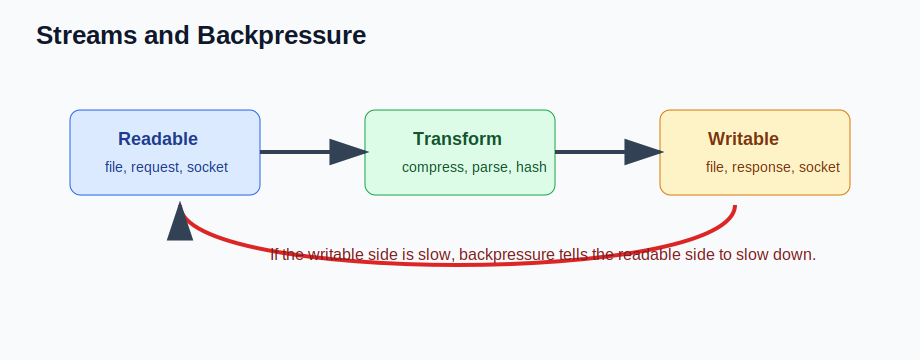

# Streams, Backpressure, and pipeline (Senior Backend Node.js Engineer Perspective)

Before going deeper into frameworks or libraries, understand this topic as part of real backend engineering: processing large or continuous data safely without loading everything into memory.

---

# 1. Fundamentals

* This topic is a production backend concern, not just a syntax detail.
* A senior Node.js engineer should understand the runtime behavior, the API contract, and the operational risks.
* The practical goal is to build services that are correct, observable, secure, and easy to change.
* Use small examples to learn the API, then connect the API to real request flows and failure modes.

---

# 2. Core Concepts

| Concept | Practical meaning |
| ------- | ----------------- |
| Readable | Produces chunks. |
| Writable | Consumes chunks. |
| Duplex | Readable and writable at the same time. |
| Transform | Changes chunks while passing them through. |
| Backpressure | Signal that the consumer is slower than the producer. |

---

# 3. Internal Working

* Core modules are part of Node.js and do not require npm installation.
* Many core APIs expose both callback and promise variants; modern application code usually prefers promise APIs.
* Streams, HTTP requests, process I/O, and many filesystem objects are event-driven abstractions.

---

# 4. Common Mistakes

* Building paths with string concatenation instead of the path module.
* Loading large files fully into memory when a stream would be safer.
* Forgetting error listeners on EventEmitters and streams.
* Mixing CommonJS and ESM without understanding loading semantics.

---

# 5. Best Practices

* Prefer path helpers, fs/promises, pipeline, AbortController, and explicit error handling.
* Use streams for large or continuous data.
* Wrap low-level core modules behind small application-specific helpers.
* Know the core APIs well enough to debug framework behavior.

---

# 6. Code Example

```js
import { createReadStream, createWriteStream } from "node:fs";
import { pipeline } from "node:stream/promises";
import { createGzip } from "node:zlib";

await pipeline(
  createReadStream("access.log"),
  createGzip(),
  createWriteStream("access.log.gz")
);
```

---


---


# 7. Real-world Scenarios

* Building a service where streams, backpressure, and pipeline affects correctness or latency.
* Debugging a production issue caused by a weak mental model of streams, backpressure, and pipeline.
* Explaining streams, backpressure, and pipeline in a senior backend interview with tradeoffs and examples.

---

# 8. Senior Deep Dive

## When to Use

* Prefer path helpers, fs/promises, pipeline, AbortController, and explicit error handling.
* Use streams for large or continuous data.
* Wrap low-level core modules behind small application-specific helpers.
* Know the core APIs well enough to debug framework behavior.

## Debug Checklist

* Reproduce with the smallest input and environment that fails.
* Inspect logs, stack traces, request data, resource usage, and dependency behavior.
* Does this handle large data safely?
* Are paths and errors cross-platform?
* Would a stream or pipeline be safer?

## Code Review Checklist

* Does this handle large data safely?
* Are paths and errors cross-platform?
* Would a stream or pipeline be safer?

---

# Revision Notes

* This topic matters because backend bugs affect users, data, security, and operations.
* Learn the runtime mental model before memorizing framework syntax.
* Prefer small examples, tests, and production-style failure checks.
* This topic is a production backend concern, not just a syntax detail.
* A senior Node.js engineer should understand the runtime behavior, the API contract, and the operational risks.
* The practical goal is to build services that are correct, observable, secure, and easy to change.

---

# Cheat Sheet

| Concept | Practical meaning |
| ------- | ----------------- |
| Readable | Produces chunks. |
| Writable | Consumes chunks. |
| Duplex | Readable and writable at the same time. |
| Transform | Changes chunks while passing them through. |
| Backpressure | Signal that the consumer is slower than the producer. |

---

# Interview Questions with Answers

### 1. How would you explain Streams, Backpressure, and pipeline in a real backend project?

Streams, Backpressure, and pipeline should be explained through the request or process flow it affects, the runtime behavior behind it, and the production tradeoff. A senior answer connects the API to latency, correctness, failure handling, and maintainability.

### 2. What happens internally when Streams, Backpressure, and pipeline is involved?

Core modules are part of Node.js and do not require npm installation. Many core APIs expose both callback and promise variants; modern application code usually prefers promise APIs. Streams, HTTP requests, process I/O, and many filesystem objects are event-driven abstractions.

### 3. What is a common production bug related to Streams, Backpressure, and pipeline?

Building paths with string concatenation instead of the path module.

### 4. How would you debug an issue in Streams, Backpressure, and pipeline?

Reproduce the failing input, inspect logs and stack traces, isolate the boundary involved, add focused instrumentation, and write a regression test once the cause is known.

### 5. What should a senior engineer check in code review?

Does this handle large data safely? Are paths and errors cross-platform? Would a stream or pipeline be safer?

---

# Hands-on Exercises

## Exercise 1

Build a small example that demonstrates this topic: Streams, Backpressure, and pipeline.

### Solution

Keep it focused, handle one failure path, and write down what happens internally.

## Exercise 2

Turn this topic into a code review checklist: Streams, Backpressure, and pipeline.

### Solution

Include these checks: Does this handle large data safely? Are paths and errors cross-platform? Would a stream or pipeline be safer?

---

# Senior Backend Engineer Takeaway

For senior-level work, Streams, Backpressure, and pipeline is not only an API or syntax detail. You should be able to explain the mental model, choose the right pattern for a product requirement, identify common failure modes, and verify behavior with tests, logs, profiling, and production-aware review.
