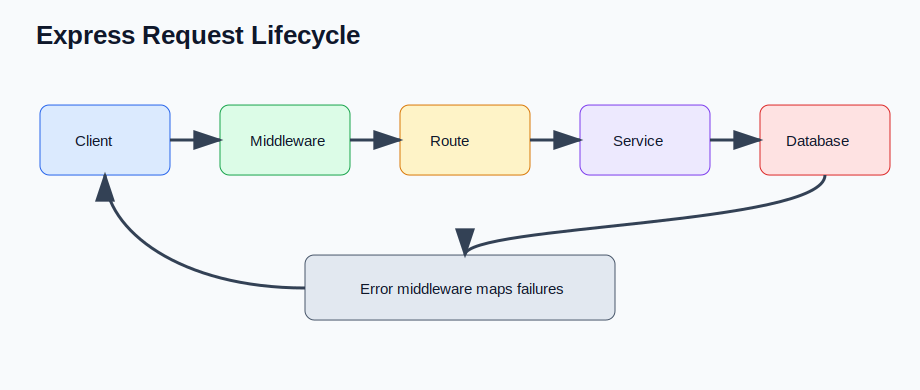

# Express Introduction and HTTP Server (Senior Backend Node.js Engineer Perspective)

Before going deeper into frameworks or libraries, understand this topic as part of real backend engineering: using Express as a thin HTTP layer over Node core.

---

# 1. Fundamentals

* This topic is a production backend concern, not just a syntax detail.
* A senior Node.js engineer should understand the runtime behavior, the API contract, and the operational risks.
* The practical goal is to build services that are correct, observable, secure, and easy to change.
* Use small examples to learn the API, then connect the API to real request flows and failure modes.

---

# 2. Core Concepts

| Concept | Practical meaning |
| ------- | ----------------- |
| app | Express application that registers middleware and routes. |
| Route | HTTP method plus path plus handler. |
| Middleware | Function that runs during request handling. |
| Request | Incoming HTTP data. |
| Response | Outgoing HTTP data. |

---

# 3. Internal Working

* Express is a routing and middleware layer on top of Node's HTTP server.
* Middleware runs in registration order and must either end the response or call next.
* Requests and responses are streams, even when Express hides most stream details.

---

# 4. Common Mistakes

* Forgetting to return after sending a response and accidentally continuing request logic.
* Putting business logic directly inside route handlers.
* Letting validation, auth, and error behavior drift across routes.
* Using generic 500 responses for client input errors.

---

# 5. Best Practices

* Keep route handlers thin: parse input, call a service, send a response.
* Centralize validation, authentication, and error mapping.
* Use correct status codes and response shapes.
* Test APIs through HTTP using Supertest or an equivalent tool.

---

# 6. Code Example

```js
import express from "express";

const app = express();
app.use(express.json());

app.get("/health", (req, res) => {
  res.json({ ok: true });
});

app.listen(3000, () => console.log("listening on 3000"));
```

---


---


# 7. Real-world Scenarios

* Building a service where express introduction and http server affects correctness or latency.
* Debugging a production issue caused by a weak mental model of express introduction and http server.
* Explaining express introduction and http server in a senior backend interview with tradeoffs and examples.

---

# 8. Senior Deep Dive

## When to Use

* Keep route handlers thin: parse input, call a service, send a response.
* Centralize validation, authentication, and error mapping.
* Use correct status codes and response shapes.
* Test APIs through HTTP using Supertest or an equivalent tool.

## Debug Checklist

* Reproduce with the smallest input and environment that fails.
* Inspect logs, stack traces, request data, resource usage, and dependency behavior.
* Is the controller thin?
* Are validation and auth centralized?
* Are status codes and errors consistent?

## Code Review Checklist

* Is the controller thin?
* Are validation and auth centralized?
* Are status codes and errors consistent?

---

# Revision Notes

* This topic matters because backend bugs affect users, data, security, and operations.
* Learn the runtime mental model before memorizing framework syntax.
* Prefer small examples, tests, and production-style failure checks.
* This topic is a production backend concern, not just a syntax detail.
* A senior Node.js engineer should understand the runtime behavior, the API contract, and the operational risks.
* The practical goal is to build services that are correct, observable, secure, and easy to change.

---

# Cheat Sheet

| Concept | Practical meaning |
| ------- | ----------------- |
| app | Express application that registers middleware and routes. |
| Route | HTTP method plus path plus handler. |
| Middleware | Function that runs during request handling. |
| Request | Incoming HTTP data. |
| Response | Outgoing HTTP data. |

---

# Interview Questions with Answers

### 1. In production, what does Express actually add on top of Node's HTTP server?

Express gives a middleware stack, routing, request helpers, response helpers, and error flow. It does not remove HTTP concerns like streaming, timeouts, body limits, connection handling, or graceful shutdown.

### 2. How would you structure a small Express API so it does not turn into route-handler spaghetti?

Keep handlers thin: parse request data, call a service, and map the result to HTTP. Put business rules in services, data access behind repositories or models, and cross-cutting behavior like auth and validation in middleware.

### 3. What is the bug when a handler sends `res.json()` and then continues executing?

The code may perform extra writes, call `next()`, or attempt a second response after headers are already sent. I usually return immediately after sending or structure the handler so response paths are explicit.

### 4. What production settings do you check before exposing an Express server publicly?

Body size limits, proxy trust, timeouts, CORS policy, security headers, error handling, logging, health checks, and graceful shutdown. Defaults that are fine in demos are often weak boundaries in production.

### 5. How do you test that an Express endpoint behaves correctly as HTTP, not just as a function?

Use an HTTP-level test tool such as Supertest to assert status code, response body, headers, and error shape. Unit tests for services are useful, but they do not prove the route is wired correctly.

---

# Hands-on Exercises

## Exercise 1

Build a small example that demonstrates this topic: Express Introduction and HTTP Server.

### Solution

Keep it focused, handle one failure path, and write down what happens internally.

## Exercise 2

Turn this topic into a code review checklist: Express Introduction and HTTP Server.

### Solution

Include these checks: Is the controller thin? Are validation and auth centralized? Are status codes and errors consistent?

---

# Senior Backend Engineer Takeaway

For senior-level work, Express Introduction and HTTP Server is not only an API or syntax detail. You should be able to explain the mental model, choose the right pattern for a product requirement, identify common failure modes, and verify behavior with tests, logs, profiling, and production-aware review.
