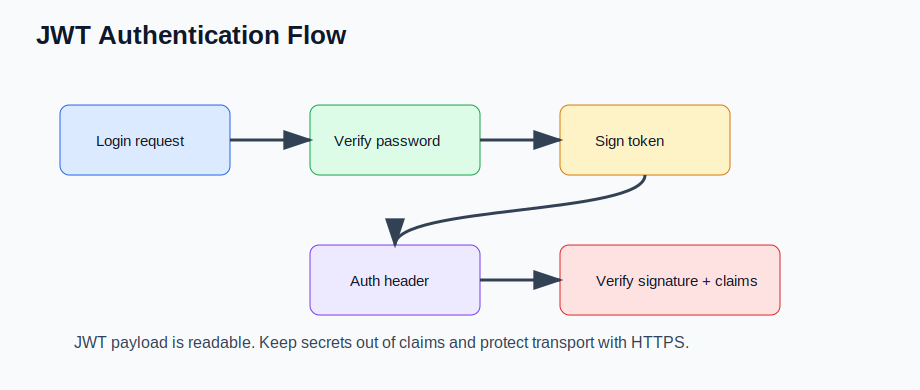

# JWT Authentication Tokens (Senior Backend Node.js Engineer Perspective)

Before going deeper into frameworks or libraries, understand this topic as part of real backend engineering: using signed tokens without confusing readability with secrecy.

---

# 1. Fundamentals

* This topic is a production backend concern, not just a syntax detail.
* A senior Node.js engineer should understand the runtime behavior, the API contract, and the operational risks.
* The practical goal is to build services that are correct, observable, secure, and easy to change.
* Use small examples to learn the API, then connect the API to real request flows and failure modes.

---

# 2. Core Concepts

| Concept | Practical meaning |
| ------- | ----------------- |
| Header | JWT metadata such as algorithm and token type. |
| Payload | Claims such as subject, role, or expiration. |
| Signature | Proof that the token was signed by a trusted secret or private key. |
| Bearer token | Token sent in Authorization header. |
| Revocation | Invalidating a token before its natural expiration. |

---

# 3. Internal Working

* Authentication proves who the caller is; authorization decides what that caller can do.
* JWTs are signed, not encrypted by default; anyone can decode the payload but cannot forge it without the signing secret.
* Browsers enforce CORS, while servers must still enforce authentication, authorization, validation, and rate limits.

---

# 4. Common Mistakes

* Putting sensitive data into JWT payloads.
* Storing plaintext passwords or using fast hashes for passwords.
* Confusing CORS with backend access control.
* Returning different error details that leak user existence or internal state.

---

# 5. Best Practices

* Hash passwords with bcrypt, argon2, or another password-hashing algorithm.
* Keep secrets in environment-managed secret stores, never in source.
* Use middleware for authentication and policy checks.
* Add input validation, rate limiting, security headers, and audit-friendly logs.

---

# 6. Code Example

```js
import jwt from "jsonwebtoken";

const token = jwt.sign({ sub: user.id }, process.env.JWT_SECRET, { expiresIn: "15m" });
const payload = jwt.verify(token, process.env.JWT_SECRET);
```

---


---


# 7. Real-world Scenarios

* Building a service where jwt authentication tokens affects correctness or latency.
* Debugging a production issue caused by a weak mental model of jwt authentication tokens.
* Explaining jwt authentication tokens in a senior backend interview with tradeoffs and examples.

---

# 8. Senior Deep Dive

## When to Use

* Hash passwords with bcrypt, argon2, or another password-hashing algorithm.
* Keep secrets in environment-managed secret stores, never in source.
* Use middleware for authentication and policy checks.
* Add input validation, rate limiting, security headers, and audit-friendly logs.

## Debug Checklist

* Reproduce with the smallest input and environment that fails.
* Inspect logs, stack traces, request data, resource usage, and dependency behavior.
* What can an attacker control?
* What secrets or PII could leak?
* Is authorization checked at the resource level?

## Code Review Checklist

* What can an attacker control?
* What secrets or PII could leak?
* Is authorization checked at the resource level?

---

# Revision Notes

* This topic matters because backend bugs affect users, data, security, and operations.
* Learn the runtime mental model before memorizing framework syntax.
* Prefer small examples, tests, and production-style failure checks.
* This topic is a production backend concern, not just a syntax detail.
* A senior Node.js engineer should understand the runtime behavior, the API contract, and the operational risks.
* The practical goal is to build services that are correct, observable, secure, and easy to change.

---

# Cheat Sheet

| Concept | Practical meaning |
| ------- | ----------------- |
| Header | JWT metadata such as algorithm and token type. |
| Payload | Claims such as subject, role, or expiration. |
| Signature | Proof that the token was signed by a trusted secret or private key. |
| Bearer token | Token sent in Authorization header. |
| Revocation | Invalidating a token before its natural expiration. |

---

# Interview Questions with Answers

### 1. What should you put in a JWT access token, and what should you leave out?

Put only stable, minimal claims needed for authorization decisions, such as subject, issuer, audience, expiry, and maybe role or tenant. Do not put secrets, personal data, or anything you need to revoke instantly without extra server-side checks.

### 2. How do you validate a JWT correctly on an API request?

Verify signature, algorithm, issuer, audience, expiry, and not-before if used. Then map the subject to current server-side state if account status, tenant membership, or token revocation matters.

### 3. Why are short-lived access tokens often paired with refresh tokens?

Short-lived access tokens limit damage if stolen, while refresh tokens let users stay signed in. Refresh tokens need stronger storage, rotation, reuse detection, and a way to revoke sessions.

### 4. How would you handle logout with JWTs?

For access tokens, logout usually deletes the client copy and relies on short expiry. For stronger logout, track token ids or session versions server-side and reject tokens that were revoked after issuance.

### 5. What is a common JWT mistake you look for in code review?

Accepting a decoded token without verifying it, or failing to pin expected algorithms, issuer, and audience. Another common issue is using long-lived tokens as if they were server-side sessions.

---

# Hands-on Exercises

## Exercise 1

Build a small example that demonstrates this topic: JWT Authentication Tokens.

### Solution

Keep it focused, handle one failure path, and write down what happens internally.

## Exercise 2

Turn this topic into a code review checklist: JWT Authentication Tokens.

### Solution

Include these checks: What can an attacker control? What secrets or PII could leak? Is authorization checked at the resource level?

---

# Senior Backend Engineer Takeaway

For senior-level work, JWT Authentication Tokens is not only an API or syntax detail. You should be able to explain the mental model, choose the right pattern for a product requirement, identify common failure modes, and verify behavior with tests, logs, profiling, and production-aware review.
